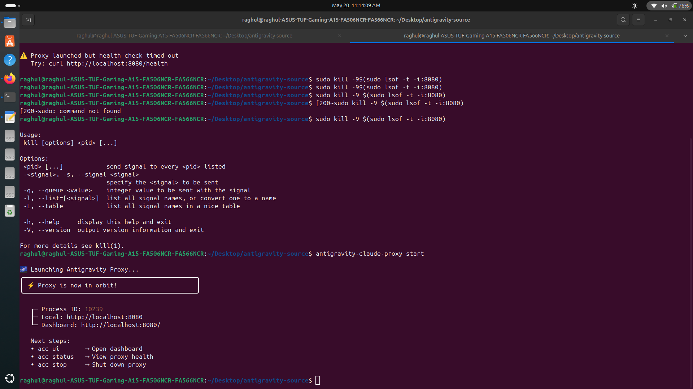
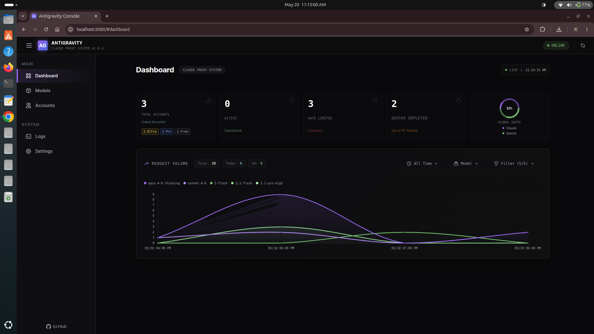

# 🚀 Antigravity Claude Proxy — My Setup

Personal documentation of setting up Antigravity Claude Proxy on Linux.

Original tool: https://github.com/badri-s2001/antigravity-claude-proxy

## My Configuration
- 3 Accounts: Ultra + Pro + Free
- Runtime: Node.js v24 via NVM
- OS: Ubuntu Linux
- Dashboard: localhost:8080
- Version: v2.8.4

## How to Start
antigravity-claude-proxy start

## What I Learned
- Proxy server architecture
- API load balancing
- Rate limit handling
- Linux process management

## Screenshots

### Dashboard

### Terminal

## Screenshots

### Dashboard

### Terminal

